# Detection of Online Sexism Documentation

## Software Engineering for Al-enabled Systems A.A. 2023/24
### Contributors

DetectionOfOnlineSexism team:
- Grazia Perna [g.perna4@studenti.uniba.it]
- Maria Elena Zaza [m.zaza16@studenti.uniba.it]
- Francesco Brescia [f.brescia10@studenti.uniba.it]

For more information see [GitHubRepo](https://github.com/se4ai2324-uniba/DetectionOfOnlineSexism.git).

## Summary
1. [Model Card](#model-card)

   1.1.   [Model Details](#model-details)
   
      1.1.2.   [Basic Information about the Model](#basic-information-about-the-model)

   1.2.  [Intended Use](#intended-use)

      1.2.1.  [Primary Intended Uses](#primary-intended-uses)

      1.2.2.  [Primary Intended Users](#primary-intended-users)

      1.2.3.  [Out-of-Scope](#out-of-scope)

   1.3.  [Factors](#factors)

   1.4.  [Metrics](#metrics)
   
   1.5.  [Evaluation Data](#evaluation-data)

      1.5.1.   [Dataset](#dataset)

      1.5.2.   [Motivation](#motivation)

      1.5.3.   [Preprocessing](#preprocessing)

   1.6.  [Ethical Considerations](#ethical-considerations)

   1.7.  [Caveats and Recommendations](#caveats-and-recommendations)

2. [Dataset Card](#dataset-card)

   2.1. [Dataset Description](#dataset-description)

   2.2. [Dataset Summary](#dataset-summary)

   2.3.. [Languages](#languages)

   2.4. [Dataset Structure](#dataset-structure)

      2.4.1. [Data Instances](#data-instances)

      4.4.2. [Data Splits](#data-splits)

3. [DVC, MLflow, and DagsHub Integration for Machine Learning Projects](#dvc-mlflow-and-dagshub-integration-for-machine-learning-projects)

   3.1. [Overview](#overview)

   3.2. [Features](#features)

   3.3. [Installation](#installation)

   3.4. [Usage](#usage)

      3.4.1. [Setting Up DVC](#setting-up-dvc)

      3.4.2. [Integrating MLflow](#integrating-mlflow)

   3.5. [Integrating with DagsHub](#integrating-with-dagshub)

   3.6. [Combining DVC, MLflow, and DagsHub](#combining-dvc-mlflow-and-dagshub)

   3.7. [Versioning Data and Models](#versioning-data-and-models)

   3.8. [Experiment Tracking](#experiment-tracking)

   3.9. [Model Deployment](#model-deployment)

   3.10. [Best Practices](#best-practices)

4. [Test](#test)

   4.1.  [Introduction](#introduction)

   4.2.  [Tools](#tools)

      4.2.1.  [Pytest](#pytest)

      4.2.2.   [Great Expectations](#great-expectations)

   4.3.  [Behavioral tests](#behavioral-tests)

      4.3.1.   [Directional Test](#directional-test)

            4.3.1.1.   [Model A](#model-a)

            4.3.1.2.   [Model B](#model-b)

      4.3.2.   [Invariance Test](#invariance-test)

            4.3.2.1.   [Model A](#model-a-1)

            4.3.2.2.   [Model B](#model-b-1)

      4.3.3.   [Minimum Functionality Test](#minimum-functionality-test)

            4.3.3.1.   [Model A](#model-a-2)

            4.3.3.2.   [Model B](#model-b-2)

      4.3.4.   [Dataset tests](#dataset-tests)

            4.3.4.1.   [Model A](#model-a-3)

            4.3.4.2.   [Model B](#model-b-3)

      4.3.5.   [Model training tests](#model-training-tests)

      4.3.6.   [Preprocessing tests](#preprocessing-tests)

5. [Source Code](#source-code)

   5.1.  [Introduction](#introduction-1)

   5.2.  [API with FastAPI](#api-with-fastapi)

      5.2.1.  [System Functionalities](#system-functionalities)

      5.2.2.  [Running the API](#running-the-api)

      5.2.3.  [Swagger UI](#swagger-ui)

   5.3.    [API tests](#api-tests)

6. [Docker](#docker)

   6.1   [Components](#components)

   6.2   [Docker File Configuration](#docker-file-configuration)
   
   6.3   [Building and Running the Docker Container](#building-and-running-the-docker-container)

   6.4   [Docker Compose Configuration](#docker-compose-configuration)

   6.5   [Usage](#usage)

7. [GitHub Actions](#github-actions)

   7.1   [Introduction](#introduction-3)

8. [System Deploy](#system-deploy)

   8.1   [Introduction](#introduction-4)

   8.2   [Azure](#azure)
   
   8.3   [Deploy a multi-container group using Docker Compose](#deploy-a-multi-container-group-using-docker-compose)

      8.3.1 [Create and Log in to Azure container registry](#create-and-log-in-to-azure-container-registry)

      8.3.2 [Docker compose file](#docker-compose-file)

      8.3.3 [Run multi-container application locally](#run-multi-container-application-locally)

      8.3.4 [Push image to container registry](#push-image-to-container-registry)

      8.3.5 [Create Azure context](#create-azure-context)

      8.3.6 [Deploy application to Azure Container Instances](#deploy-application-to-azure-container-instances)

               8.3.1.6.1. [Frontend](#frontend)

               8.3.1.6.2. [Backend](#backend)

   8.4.   [Deploy the Prometheus dashboard creating a Web-App](#deploy-the-prometheus-dashboard-creating-a-web-app)

      8.4.1.   [Push image to container registry](#push-image-to-container-registry-1)

      8.4.2.   [Create Azure Web-App](#create-azure-web-app)

9. [Codecarbon](#codecarbon)

   9.1.  [Codecarbon configuration](#codecarbon-configuration)

   9.2.  [Code explanation](#code-explanation)

   9.3.  [Results](#results)


10.   [Monitoring](#monitoring)

   10.1. [Detection of Online Sexism Load Testing](#detection-of-online-sexism-load-testing)

      10.1.1.  [Overview](#overview)

      10.1.2.  [Features](#features)
      
      10.1.3.  [Installation](#installation)

      10.1.4.  [Usage](#usage)

      10.1.5.  [File Description](#file-description)

   10.2. [BetterUpTime](#betteruptime)

      10.2.1.  [Features](#features-1)
  
   10.3. [Monitoring with Prometheus and Grafana](#monitoring-with-prometheus-and-grafana)

      10.3.1.  [Prometheus](#prometheus)

         10.3.1.1.   [Configuration](#configuration)

         10.3.1.2.   [How to execute docker-compose.yml](#how-to-execute-docker-composeyml)

      10.3.2   [Grafana](#grafana)

         10.3.2.1.   [Configuration](#configuration-1)

11.   [Drift Detection with Alibi Detect](#drift-detection-with-alibi-detect)

   11.1. [Alibi Detect](#alibi-detect)

   11.2. [Drift Detection](#drift-detection-1)
   
   11.3. [Results](#results)


## Model Card
###  Model Details 
####  Basic information about the model
The project described in this  has been developed for the "SemEval 2023 - Task 10 - Explainable Detection of Online Sexism (EDOS)" challenge on CodaLab by Grazia Perna and Maria Elena Zaza in which two models have been implemented.

Before training the models, the used data was preprocessed to remove spaces, convert text to lowercase and eliminate punctuation. Other techniques like tokenization and lemmatization (for task A) were also used here.
The preprocessed text was then inserted into a CountVectorizer, which transformed the text into numerical features suitable for classification.

The models have two hierarchical tasks:
- TASK A - Sexism Detection: for detecting whether a post is sexist by using the LinearSVC classifier.
- TASK B - Category of Sexism: for assigning to each of the sexist texts one of the following categories:
    - threats
    - derogation
    - animosity
    - prejudiced discussions

To evaluate the performance of the models the GriSearchCV was employed for performing the hyperparameter tuning in order to determine the optimal values of the models. It uses the Cross-Validation method, fixed to 10.

The project, the paper and a simple demo are available at: https://github.com/graziaperna/NLP-project.


### Intended Use 
#### Primary intended uses

The primary use case on which the model is trained on is to detect if a message is sexist or not and in a positive case it will understand the type of sexism it belongs. Words can be sexist or not according to the context.
The models can be used in several domains:
- Messenger services
- Investigations
- Journalism
- Publishing

#### Primary intended users

The primary intended users of this study caters primarily to researchers, practitioners and participants engaged in the field of natural language processing. This audience includes individuals and entities actively involved in the development and implementation of algorithms and models for the detection and categorization of online sexism.
Additionally, participants and researchers involved in similar challenges or projects addressing nuanced language analysis and detection of sensitive content may find our work relevant and insightful.

#### Out-of-scope

This project is limited to the English language because of the used dataset. 
Also it doesn't consider cultural factors. The dataset is related to the western geographical area but the challenge's website doesn't provide any additional information. 

### Factors 

The accuracy of the results of these models can be influenced by several demographic factors, like the language, the culture, the age and the gender.

### Metrics 

The data were divided into three splits: train, validation and test. As a matter of fact, the models were trained using the train set.
Then the validation set was used to assess their performance and make any necessary adjustments or tuning. Finally, the test set was employed to evaluate the models' generalization ability and obtain their final performance metrics.
The metric computed were:
- Precision
- Recall
- F1

For each of these metrics were considered the macro measure.
In the following table the model performance measures computed on validation and test set are shown respectively:


| Task | Precision | Recall | F1     |
|------|-----------|--------|--------|
| A    | 0.7899    | 0.7255 | 0.7481 |
| B    | 0.5258    | 0.4491 | 0.4675 |

| Task | Precision | Recall | F1       |
|------|-----------|--------|----------|
| A    | 0.7947    | 0.7444 | 0.7637   |
| B    | 0.4932    | 0.4438 | 0.4597   |

The best SOTA results are related to the task A, while in the task B the results are not so promising due to the complexity of the problem.


### Evaluation Data 
#### Dataset: 
The dataset is given by the "SemEval 2023 - Task 10 - Explainable Detection of Online Sexism (EDOS)" challenge and it has 19988 samples. 
#### Motivation: 
This project was developed for this specific challenge. 
#### Preprocessing: 
For Task A we implemented a custom text cleaning function to remove spaces, convert text to lowercase and eliminate punctuation. We used TreeBankTokenizer and the WordNetLemmatizer for lemmatization.
The cleaned text was then fed into a CountVectorizer, which transformed the text into numerical features suitable for classification.
Both individual words and word pairs (n-grams) were considered by the vectorizers.

### Ethical Considerations

In this study ethical considerations were prioritized:
- avoid perpetuating stereotypes and worked towards fair and unbiased representation in the detection and categorization of online sexism
- consider the ethical implications of deploying automated systems for sensitive tasks and advocate for ongoing discussions surrounding the ethical use of AI technologies

By addressing these ethical considerations, this project to contribute responsibly to the exploration of online sexism detection, recognizing the importance of maintaining integrity, fairness and respect for individuals throughout the research process.

### Caveats and Recommendations

A very huge limitation is that the dataset considers the context in which the message are used. That can change consistently the results. In addition it works only with the english language so it can be used only in certain countries.


## Dataset card
### Dataset Description

- title = SemEval-2023 Task 10: Explainable Detection of Online Sexism,
- url = http://arxiv.org/abs/2303.04222,
- doi = 10.48550/arXiv.2303.04222,
- author = Kirk, Hannah Rose and Yin, Wenjie and Vidgen, Bertie and Röttger, Paul,
- booktitle = Proceedings of the 17th International Workshop on Semantic Evaluation (SemEval-2023),
- publisher = Association for Computational Linguistics,
- year = 2023

### Dataset Summary
Online sexism is a widespread and harmful phenomenon. To address this issue "SemEval Task 10 on the Explainable Detection of Online Sexism" (EDOS) has been introduced. 
Have been done two main contributions:
- a novel hierarchical taxonomy of sexist content, which includes granular vectors of sexism to aid explainability; 

- a new dataset of 20,000 social media comments with fine-grained labels, along with larger unlabelled datasets for model adaptation.

#### Languages
This task supports the development of English-language models for sexism detection that are more accurate as well as explainable.

### Dataset Structure
#### Data Instances
The dataset has two columns: 
- `rewire_id`: is the unique ID of each entry, as specified in the dev/test data;
- `label_pred`: is the string label predicted by your model for each entry. The label names must exactly match those from the training data.

For Task A, label_pred must be one of two labels:
- `not sexist`;
- `sexist`.

For Task B, label_pred must be one of four labels:

1. `threats, plans to harm and incitement`;
2. `derogation`;
3. `animosity`;
4. `prejudiced discussions`.

#### Data Splits

The dataset has been splitted into validation, test and training set.
The class distribution for
Task A was as follows:
- TRAIN SET:
    - not sexist: 10602
    - sexist: 3398
- DEV SET:
    - not sexist: 1514
    - sexist: 486
- TEST SET:
    - not sexist: 3030
    - sexist: 970

As regards task B, the class distribution was:
- TRAIN SET:
    - derogation: 1590
    - animosity: 1165
    - prejudiced discussions: 333
    - threats, plans to harm and incitement:310
- DEV SET:
    - derogation: 227
    - animosity: 167
    - prejudiced discussions: 48
    - threats, plans to harm and incitement: 44
- TEST SET:
    - derogation: 454
    - animosity: 333
    - prejudiced discussions: 94
    - threats, plans to harm and incitement: 89

## DVC, MLflow, and DagsHub Integration for Machine Learning Projects

This project employs DVC (Data Version Control), MLflow, and DagsHub to manage and track the machine learning lifecycle. DVC is an open-source version control system tailored for data science and machine learning projects. MLflow is an open-source platform that handles the end-to-end machine learning lifecycle. DagsHub complements these tools by providing a platform for collaboration on data science projects.

### Overview

The integration of DVC, MLflow, and DagsHub provides a comprehensive solution for dataset management, versioning, experiment tracking, and model deployment. This synergy enhances the reproducibility, monitoring, and collaboration of machine learning projects.

### Features

- **Data Versioning with DVC**: Manages and version-controls large datasets and machine learning models, facilitating data sharing and collaboration.
- **Experiment Tracking with MLflow**: Records and compares experiments, parameters, and results, streamlining the model development process.
- **Model Deployment**: Leverages MLflow's model registry for consistent and organized deployment across various environments.
- **Collaboration with DagsHub**: Integrates with DVC and MLflow, offering a collaborative platform for team members to share, discuss, and track progress.
- **Reproducibility**: Ensure experiments are reproducible with version-controlled data and models.


### Installation

Before you begin, ensure you have Python installed on your system. Then, install DVC and MLflow using pip:

```bash
pip install dvc mlflow
```

### Usage

#### Setting Up DVC

1. **Initialize DVC in your Project**:
   ```bash
   dvc init
   git status
   git commit -m "Initialize DVC"
   ```

2. **Add Data to DVC**:
   Track large datasets or models with DVC:
   ```bash
   dvc add data/Raw/dataset.csv
   git add data/.gitignore data/Raw/dataset.csv.dvc
   git commit -m "Add dataset to DVC"
   ```

#### Integrating MLflow

1. **Configure MLflow**:
   Set the tracking URI and specify the experiment name:
   ```bash
   mlflow set-tracking-uri ./mlruns
   mlflow create-experiment "my_experiment"
   ```

2. **Run an MLflow Experiment**:
   Utilize MLflow to log parameters, metrics, and models:
   ```python
   import mlflow

   with mlflow.start_run():
       mlflow.log_param("param_name", value)
       mlflow.log_metric("metric_name", value)
       mlflow.log_artifact("path/to/artifact")
   ```

### Integrating with DagsHub
DagsHub provides a platform for sharing experiments, data, and progress with team members, enhancing collaboration and transparency in the project. 
Indeed its goal consists in reducing the friction by integrating all solutions in only one platform and avoid the constant switching between them

Builds on top of:
* Git: to track source code
* DVC: to track data
* MLflow: to track experiments

So, we create a DagsHub repository to push and share your DVC and MLflow configurations and results. [DagsHub Repository](https://dagshub.com/se4ai2324-uniba/DetectionOfOnlineSexism)

1. **Set Up a DagsHub Repository**:
Create a repository on DagsHub and link it with your project.

2. **Push Changes to DagsHub**:
Commit and push your changes to the DagsHub repository to share your progress.

### Combining DVC, MLflow, and DagsHub

Use DVC for data and model management, MLflow for experiment tracking, and DagsHub for collaboration:

```bash
dvc pull data/Raw/dataset.csv.dvc
python mlflow_experiment.py
git add .
git commit -m "Update experiment"
git push origin main
```


### Versioning Data and Models

DVC tracks changes in your data and models. Use `dvc push` and `dvc pull` commands to synchronize your large files with remote storage, ensuring consistency across environments.


### Experiment Tracking

MLflow tracks each experiment's parameters, metrics, and output models, making it easy to compare different runs and select the best model for deployment.


### Model Deployment

Utilize MLflow's model registry for deploying models to various production environments, ensuring a smooth transition from experimentation to deployment.

### Best Practices

- Regularly commit changes in data and code to ensure reproducibility.
- Log all relevant experiment details in MLflow to facilitate analysis and comparison.
- Use DVC remotes for backing up and sharing large datasets and models.

## Test 

### Introduction

In our commitment to ensuring the reliability and robustness of our project, we have implemented a comprehensive testing suite. This suite encompasses various forms of testing, each targeting specific components and functionalities of our system. Our aim is to maintain high standards of quality and correctness throughout the development lifecycle. 

The tests conducted are categorized as follows:

- **Behavioral Testing**: These tests are designed to validate the functionality of our application against the expected behavior. By simulating user interactions and system processes, we ensure that the application performs as intended in real-world scenarios.

- **Dataset Testing**: Given the critical role of data in our project, dataset tests focus on verifying the integrity, accuracy, and formatting of our datasets. These tests are crucial for ensuring that our data pipelines are reliable and our datasets are suitable for the tasks at hand.

- **Model Training Testing**: In this category, we test the training processes of our machine learning models. This includes validation of training algorithms, hyperparameter tuning, and the overall effectiveness of the training phase. The goal is to ascertain that our models learn correctly and efficiently from our datasets.

- **Preprocessing Testing**: These tests are aimed at the preprocessing steps of our data pipeline. We validate the methods used for cleaning, normalizing, and transforming data to ensure they are correctly implemented and contribute positively to the performance of our models.

### Tools

In our project, we place a strong emphasis on the reliability and quality of our software and data. To achieve this, we utilize two key tools: `Pytest` and `Great Expectations`. These tools form the backbone of our testing and validation framework, ensuring that our project meets high standards of functionality, dependability, and efficiency.

#### Pytest

`Pytest` is a powerful and flexible testing framework for Python. It is used extensively for writing simple unit tests as well as complex functional tests. It offers features such as:

* A simple syntax for writing tests.
* The ability to run tests in parallel, significantly improving test execution time.
* Extensive support for fixtures, allowing for reusable test configurations.
* Easy integration with other tools and services for enhanced testing capabilities.

#### Great Expectations

`Great Expectations` is an advanced tool that plays a crucial role in validating, documenting, and profiling our data quality. Great Expectations helps us by:

* Validating data against a predefined set of rules and criteria, ensuring that it meets the quality standards required for accurate analysis and modeling.
* Creating clear and understandable  of our data.
* Profiling data to provide insights into its characteristics, distribution, and structure of the data.


### Behavioral tests
#### Directional Test

This type of test creates messages with distinct tokens and use the predictive models of task A and B to obtain the predicted labels for these messages. The primary objective is to assert that the predicted labels for messages featuring different tokens are not identical. So this test is designed to verify that the model can distinguish between specific tokens and generate varying predictions based on the token used in the input message. [Path: [Directory](./behavioral_testing)]

The following images contain the directional tests for model A and model B respectively:


The results obtained are shown below:
##### Model A
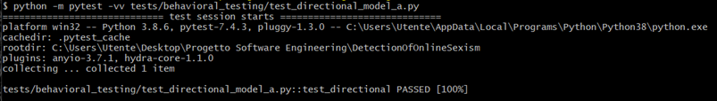

##### Model B
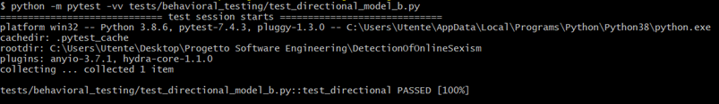

#### Invariance Test

The objective of this test is to ensure that the model's classification of a message is not influenced by the choice of synonyms like "send" or "give." The test aims to confirm that the model maintains its ability to recognize and categorize messages consistently even when variations in language are introduced. This evaluation is essential for assessing the robustness of the model's discriminatory language detection across different expressions with similar meanings. [Path: [Directory](./behavioral_testing)]

The scripts for both the models are the following:

##### Model A


##### Model B


The results obtained are shown below:

##### Model A


##### Model B
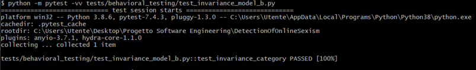

#### Minimum Functionality Test

This test serves as a comprehensive test suite for evaluating the performance of the two models of this project. The tests cover various scenarios, including different types of messages and the evaluation of model metrics. [Path: [Directory](./behavioral_testing)]

Here there is an example of minimum functionality test done for the Task A:


The results obtained are shown below:

##### Model A


##### Model B
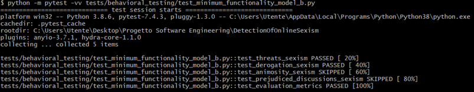

### Dataset tests

This script utilizes the Great Expectations library to perform data validation on three datasets: training, validation and test sets. The primary goal is to ensure that the datasets meet certain expectations regarding structure and content. [Path: [Directory](./dataset_testing)]

Here there is an example of dataset test done on the training dataset of the Task A:


The results obtained are shown below:

#### Model A
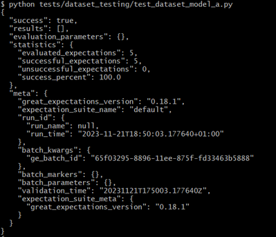


#### Model B


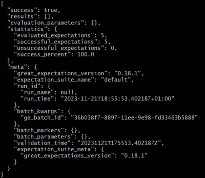

### Model training tests

It validates the training accuracy ensuring the model approximates a specified threshold. By confirming conformity to performance expectations, the test contributes to reliable machine learning model development and the assurance of accurate message classification. [Path: [Directory](./model_training_testing)]

The script is shown below:


The results obtained are shown below:


### Preprocessing tests

The tests cover scenarios such as punctuation removal, uppercase text transformation, empty input handling and processing mixed text and numbers. Successful execution confirms the effective preprocessing capability of the `clean_text` function. [Path: [Directory](./preprocessing_testing)]

The script is shown below:


The results obtained are shown below:


## Source Code 

### Introduction

The `src` directory of our project includes two main components: the API and the feature-related code. The API is built using FastAPI, a high-performance web framework for building APIs with Python 3.7+. It's designed for automatic data validation and  generation, leveraging standard Python type hints. This section also covers the use of Docker Compose to launch a monitoring infrastructure with Prometheus and Grafana, along with a custom backend and frontend.

### API with FastAPI

The API is built using [FastAPI](https://fastapi.tiangolo.com/), a modern, high-performance web framework for building APIs with Python 3.7+. FastAPI leverages standard Python type hints for automatic data validation and  generation.

#### System Functionalities

This project has several endpoints with different tasks:

1. **`/task` Endpoint:** This endpoint is the main entry point for model activities. Through this, users can access general information about available tasks and the current version of the model.

2. **`/task/A` \ `/task/B` Endpoint:** This endpoint is useful to see in detail all the relevant information regarding the choosen task (A or B), in particular:
   -  the description of the task
   -  the models used for this task
   -  the path of the metrics related to the task

3. **`/task/A/metrics` \ `/task/B/metrics` Endpoint:** This endpoint provides evaluation metrics associated with the task choosen. Metrics include F1-score, recall and precision, offering an assessment of the model's performance.

4. **`/task/A/preprocessing` \ `/task/B/preprocessing` Endpoint:** This endpoint regards the preprocessing steps associated with the specified task specified, in fact it includes information about the tokenizer, the type of vectorizer and whether a lemmatizer was applied.

5. **`/prediction_sexism` Endpoint:** This endpoint is designed to predict whether a given message is sexist or not using a pre-trained model. The function takes a message as input and uses the model to predict the label, 

6. **`/prediction_category` Endpoint:** This endpoint has the same aim of the `/prediction_sexism` endpoint but in this case the prediction regards the category of sexism of the message taken in input. 

It uses HTTP GET requests for retrieving information through the first four endpoints, meanwhile the last two endpoints are set up to handle HTTP POST requests.

#### Running the API

To start the FastAPI server:

```bash
uvicorn main:app --reload
```
#### Swagger UI
It is possible to test the API  using Swagger UI, a user-friendly interface that simplifies the understanding of API functionalities. To access to the Swagger UI, navigate too: http://127.0.0.1:8000/docs

Here is showed the main window of the UI.

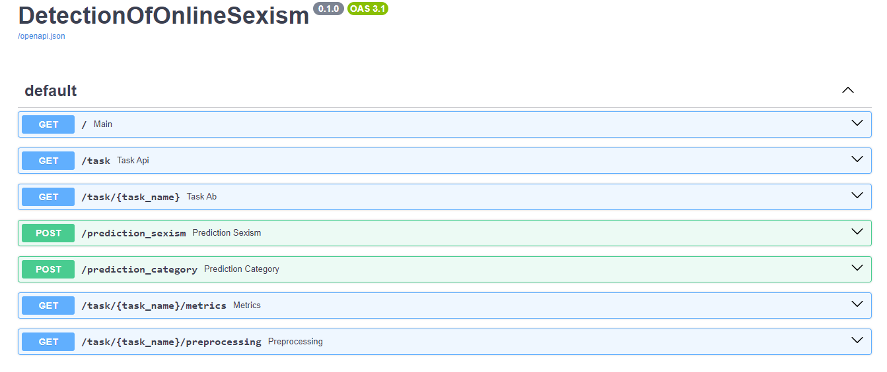

As we can see in the picture there are two endpoint used to make the prediction of a given message. 

Here there is an example of the `/prediction_sexism` endpoint.


In the response body is showned the message that has been inserted from the user and the prediction.


Instead here we have an example  of the `/prediction_category` endpoint. The user has to insert the message and then it will be displayed the result.


### API tests
Tests concerning APIs implemented with FastAPI are crucial to ensure that the application is robust, reliable, and easy to maintain and develop over time to improve its efficiency. Tests ensure that all the application's functionalities work as expected, verifying that endpoints return the correct data and respond with the appropriate status codes. When changes are made to the code, tests help ensure that existing functionalities are not accidentally disrupted. Finally, by testing various scenarios, including behavior in abnormal conditions or the submission of invalid input, the application can be ensured to be secure and stable. [Path: [Directory](./api_testing)]

The following script shows as example the test on the main endpoint:


The results obtained are shown below:


## Docker

Docker is a lightweight virtualization tool that allows us to isolate the development environment and ensure the reproducibility of our experiments.

### Components

- [Dockerfile](../Dockerfile): The Dockerfile contains instructions for creating the Docker image. This file defines the environment and dependencies required to run backend of our machine learning project.

- [docker-compose.yml](../docker-compose.yml): The docker-compose.yml file is used to configure the Docker service so that we can quickly start our development environment. It contains configurations for Docker services, volumes, and networks.

- [requirements.txt](../requirements.txt): This file lists all the Python dependencies required for our machine learning project. These dependencies will be installed when the Docker image is created.

- [data/](../data): This folder should contain all the training and test data required for the machine learning project. Make sure the data is accessible within the Docker container.

- [src/](../src): In this folder, you may want to place our development scripts that we will use during the project. These can be mounted inside the Docker container for execution and editing.

- [prometheus.yml](../prometheus.yml): The Prometheus configuration file. This file includes settings for monitoring the application, such as scrape configurations for gathering metrics from different sources, including the backend service.

### Docker File Configuration

The backend [Dockerfile](../Dockerfile) performs the following tasks:

1. **Base Image**: Starts from the `python:3.10-slim` image, a lightweight Python image.
2. **Install Dependencies**: Copies the `requirements.txt` file and installs Python packages.
3. **Download NLTK Data**: Downloads WordNet and OMW-1.4 using NLTK.
4. **Working Directory**: Sets the root directory (`/`) as the working directory.
5. **Copy Source Code**: Copies the current directory contents into the Docker image.
6. **Expose Port 8000**: Makes the port 8000 available to the outside world.
7. **Command**: Sets the default command to run `uvicorn` for the web application on port 8000.

### Building and Running the Docker Container

To build and run this web application in a Docker container, follow these steps:

1. **Build the Docker Image**:
Navigate to the main directory containing the Dockerfile and run:
```bash
docker build -t detectionofonlinesexism_backend .
```

2. **Run the Docker Container**:
Start a container from the image:
```bash
docker run -d -p 8000:8000 detectionofonlinesexism_backend
```
This command runs the container in detached mode and maps port 8000 of the container to port 8000 on the host machine.

3. **Accessing the Backend**
Once the container is running, the backend of our web application should be accessible at http://localhost:8000


### Docker Compose Configuration

The `docker-compose.yml` file defines the following services:

-  **backend**: A service representing the backend of the application. It is built from the current context `.` and the resulting image is tagged as "detectiononlinesexism_backend." It exposes port 8000 for requests and also exposes it to be scraped by Prometheus.
-  **frontend**: A service representing the frontend of the application. It is built from the context of the `./frontend` folder, and the resulting image is tagged as "detectiononlinesexism_frontend." It exposes port 80 for requests. It depends on the "backend" service.
-  **prometheus**: Uses the `prom/prometheus` image. It mounts the `./prometheus.yml` file into the container at `/etc/prometheus/prometheus.yml.` It exposes port 9090 for accessing the Prometheus web UI. It depends on the "backend" service.
-  **grafana**: Uses the `grafana/grafana` image. It exposes port 3000 for accessing the Grafana web UI. It depends on the "prometheus" service.

### Usage

To use this Docker environment for our machine learning project, follow these steps:

1. Make sure you have Docker installed on your system.

2. Navigate to the directory containing these files.

3. Build the Docker images, which define the realtive images at the backend and the frontend with the dependencies specified in `requirements.txt`.

4. Start the Docker container based on the `docker-compose.yml` configuration:
```bash
docker-compose up
```

Alternatively, you can build and start the container in one step:
```bash
docker-compose up --build  
```
Once running, you can access the Docker development environment.

5. Access the Docker development environment and begin working on our machine learning projects. In our case, we can se the following dashboard:

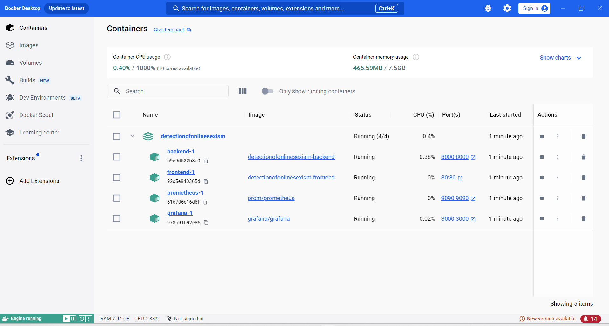

6. When you're done, you can stop the Docker container with the following command:

```bash
docker-compose down
```

## GitHub Actions 

### Introduction
GitHub Actions is a feature provided by GitHub that enables the automation of software workflows directly within the GitHub environment.
It can be used to build, test and deploy applications directly from the GitHub repository, reducing the need for external continuous integration services.

It relies on YAML configuration files that define the entire workflow. These files are placed in the `.github/workflows` directory of the repository.
A workflow consists of a series of jobs and steps, where each job represents a separate unit of work while the steps are individual tasks within a job.

We developed GitHub Actions for integrating key tools and frameworks into our project:
-   **FastAPI** for automating the building of our API [fastapi_check.yml](../.github/workflows/fastapi_check.yaml)
-   **Pydantic** for data validation, ensuring that incoming data adheres to defined models [pydantic_check.yml](../.github/workflows/pydantic_check.yaml)
-   **Pytest** for automated testing, allowing us to maintain code quality and catch potential issues early in the development process [pytest_check.yml](../.github/workflows/pytest_check.yaml)
-   **Pylint**, employed to enforce coding standards and improve code readability [pylint_check.yml](../.github/workflows/pylint_check.yaml)
-   **Alibi-detect** for providing drift detection capabilities [alibi-detect_check.yml](../.github/workflows/alibi-detect_check.yaml)

With these GitHub Actions in place, our development process is streamlined and we can confidently deliver robust and well-tested functionalities.

## System Deploy 

### Introduction

This guide is tailored to provide you with a comprehensive understanding and step-by-step instructions for leveraging the powerful capabilities of Azure to host and manage your machine learning solutions. You will be equipped with the knowledge to effectively deploy and manage your machine learning system on Azure, ensuring a scalable, secure, and high-performing application. Let's begin your journey to harnessing the full potential of Azure for your machine learning needs.

### Azure

[Azure](https://azure.microsoft.com)  is a cloud computing service created by Microsoft for building, testing, deploying, and managing applications and services through Microsoft-managed data centers. It provides a range of cloud services, including those for computing, analytics, storage, and networking. Azure offers solutions for all industries through a comprehensive set of tools and frameworks, supporting various programming languages, tools, and frameworks, including both Microsoft-specific and third-party software and systems.

### Deploy a multi-container group using Docker Compose
#### Create and Log in to Azure container registry

Before you create your container registry, you need a resource group to deploy it to. A resource group is a logical collection into which all Azure resources are deployed and managed.

```bash
az group create --name detectiononlinesexism_group --location eastus
```

Now, we can create and log in to our Azure container registry 
```bash
az acr create --resource-group detectiononlinesexism_group --name onlinesexismregistry --sku Basic

az acr login --name onlinesexismregistry
```

#### Docker compose file
Open [docker-compose.yml](../docker-compose.yml) in a text editor and we write the following configuration:

```bash
version: '3.4'

services:
  frontend:
    build: 
      context: ./frontend
    image: onlinesexismregistry.azurecr.io/frontend
    ports:
      - "80:80"

  backend:
    build: .
    image: onlinesexismregistry.azurecr.io/backend
    ports:
      - "8000:8000"
```
#### Run multi-container application locally
Ater that, we run the following instruction, which uses docker-compose.yaml file to build the container image, create the images, and start the application:

```bash
docker-compose up --build -d
```

After trying the local application, run docker-compose down to stop the application and remove the containers.
```bash
docker-compose down
```

#### Push image to container registry
To deploy the application to Azure Container Instances, we need to push the local images to our container registry:
```bash
docker-compose push
```

#### Create Azure context
To use Docker commands to run containers in Azure Container Instances, first we must log into Azure:
```bash
docker login azure
```

Then, we create an ACI context. This context associates Docker with an Azure subscription and resource group so that we can create and manage container instances.
```bash
docker context create aci myacicontext
```
#### Deploy application to Azure Container Instances
Next, change to the ACI context. Subsequent Docker commands run in this context.

```bash
docker context use myacicontext
```

Finally, we can pull the images from our container registry and start the application in the Azure Container Instances, by using the following command:
```bash
docker compose up
```
Below we can see the result:

##### Frontend


##### Backend


When we finish trying the application, stop the application and containers with:
```bash
docker compose down
```

### Deploy the Prometheus dashboard creating a Web-App

In this section, we provide a step-by-step demonstration of how the Prometheus dashboard is deployed on Azure. 

#### Push image to container registry
First of all, we create a new folder called `prometheus` where we go to insert our file [prometheus.yml](../prometheus.yml) and define a new `Dockerfile`, as follows:

```bash
FROM prom/prometheus

WORKDIR /prometheus

COPY prometheus.yml /etc/prometheus/prometheus.yml

EXPOSE 9090
ENTRYPOINT [ "/bin/prometheus" ]
CMD [ "--config.file=/etc/prometheus/prometheus.yml", "--storage.tsdb.path=/prometheus" ]
```

Then, using the following instructions respectively let’s create the new Docker image, tag it with the name of our Container Registry and finally push the image on Azure.

```bash
docker build -t prometheus .

docker tag prometheus onlinesexismregistry.azurecr.io/prometheus   

docker push onlinesexismregistry.azurecr.io/prometheus  
```

#### Create Azure Web-App
Using the Azure web interface, we create the `prometheusonlinesexism` Web-App filling the different required fields, taking care to select the option `Docker Container` as follows:


Once created the `prometheusonlinesexism` Web-App, we must select the field `Deployment Center` and chose from our Container Registry the Docker image that we want to upload on it. Below we can see the settings in the `Deployment Center`:


### Codecarbon 
**CodeCarbon** is focused on measuring and mitigating the carbon footprint associated with software development.
It takes a proactive approach to address the ecological impact of code creation.

The primary goal of CodeCarbon is to raise awareness about the environmental consequences of software development and provide developers with the tools and insights needed to make environmentally conscious coding decisions. 
For more detailed information, you can refer to the official [CodeCarbon ](https://mlco2.github.io/codecarbon/) or the [GithubRepo](https://github.com/mlco2/codecarbon).
#### Codecarbon configuration
In this section, we'll explain the `[codecarbon]`configuration :
```
[codecarbon]
log_level = DEBUG
save_to_api = True
experiment_id = 378897f8-000b-4825-bcc1-92059ab295fa
gpu_tracking = False
```
- **log_level**: Specifies the level of logging. In this case, it's set to DEBUG, which means that more detailed information will be logged. 
- **save_to_api**: A boolean flag indicating whether to save emission data to the CodeCarbon API. When set to True, the emissions data will be sent to the CodeCarbon platform for further analysis and tracking.
- **experiment_id**: A unique identifier for the experiment. This ID helps in associating the emission data with a specific experiment or project. It should be unique to distinguish different experiments.
- **gpu_tracking**: A boolean flag that determines whether GPU tracking is enabled.

#### Code explanation
We tested our two models with CodeCarbon in order to trace our carbon footprint. Users need to know these details so they can make informed choices about how environmentally sustainable their machine learning operations are.

To do this, in both [train_a](../src/models/train_a.py) and [train_b](../src/models/train_b.py) files have been added `EmissionsTracker` which refers to a tool that records and monitors the carbon emissions associated with code execution:


#### Results
These are the results we obtained after the tracking phase.

The first image is for the first model, used to detect if a message is sexist or not.


The second image is for the second model, used to specify the type of sexism.

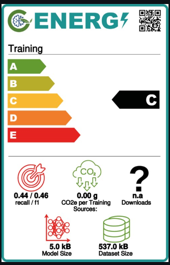

## Monitoring
### Detection of Online Sexism Load Testing

#### Overview
The file [locustfile.py](../locustfile.py) is a Python script for performing load testing on web services designed to detect online sexism. The script uses Locust, an open-source load testing tool, to simulate users accessing different endpoints and performing various tasks. The tests are designed to assess the robustness and responsiveness of the services under simulated traffic.

#### Features
* **Multiple Task Simulation**: Simulates various user tasks, including fetching main endpoint descriptions, task-specific details, preprocessing information, and sending prediction requests.
* **Custom User Behavior**: Custom user class with tasks assigned different weights, representing the likelihood of each task being performed during testing.
* **Error Handling**: Includes checks for response status codes and expected response content, raising exceptions in case of failure or unexpected responses.

#### Installation
1. Ensure that Python 3.6 or later is installed on your system.
2. Install Locust using pip:
```bash
pip install locust
```

#### Usage
1. Navigate to the directory containing the script.
2. Execute the following command to start Locust with CSV reporting:
```bash
locust -f locustfile.py --csv=report --csv-full-history
```
3. Open a web browser and go to http://localhost:8089 to access the Locust web interface.
4. Enter the total number of users to simulate (in our case 50), the spawn rate, and the host URL of the web service under test.
5. Start the load test using the web interface and monitor the results.
6. Upon completion, check the specified directory for report_stats.csv, report_stats_history.csv, report_failures.csv and report_exceptions.csv files containing the test results.

#### File Description
`locustfile.py`: The main Python script containing the definition of the Locust user class. This class includes various tasks that simulate user actions, such as accessing different endpoints and submitting data for prediction.

### BetterUpTime

BetterUpTime is a tool designed to monitor and improve the uptime of web applications. It provides real-time alerts, detailed reporting, and analytics to help teams maintain high availability and performance of their web services.

#### Features

- **Real-Time Monitoring**: Continuously monitors web applications and services for downtime.
- **Alert System**: Sends immediate notifications through email, SMS, or integrated chat applications when outages are detected.
- **Performance Analytics**: Tracks response times and availability trends over time.
- **Dashboard**: A user-friendly dashboard for an at-a-glance view of the system's health.
- **Multi-Service Support**: Capable of monitoring multiple services and endpoints simultaneously.
- **Customizable Checks**: Define the frequency and conditions for uptime checks.

### Monitoring with Prometheus and Grafana
#### Prometheus

[Prometheus](https://prometheus.io/) is an open-source monitoring and alerting toolkit designed for reliability and scalability. It collects metrics from configured targets at specified intervals, evaluates rule expressions, and can trigger alerts if conditions are met. Prometheus scrapes metrics from the "backend" service, as specified in the configuration file. The collected metrics are stored locally in a time-series database. Prometheus provides a query language (PromQL) for querying and processing the collected metrics.

In order to acquire the metrics, fastAPI and Prometheus have been connected using the `docker-compose.yml` file.

##### Configuration
The Prometheus configuration file [prometheus.yml](../prometheus.yml) contains global settings and scrape configurations.
The provided `prometheus.yml` file configures Prometheus with the following settings:

Global Configurations:
- `scrape_interval`: Metrics are collected globally every 15 seconds.
- `external_labels`: All collected metrics are labeled with 'monitor: codelab-monitor'.

Job-specific Configuration:
- Job Name: 'fastapi-it'
  - `scrape_interval`: Metrics for this job are collected every 5 seconds.
  - Target Configuration:
    - Target: 'backend:8000' - Prometheus collects metrics from a service named 'backend' on port 8000.

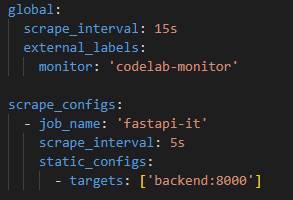

##### How to execute docker-compose.yml

1. Ensure Docker is installed.
2. Navigate to the directory containing the docker-compose.yml file.
3. Run `docker-compose up` to start the services in detached mode.
4. Now you can access the following services:

   -  **Prometheus UI**: http://localhost:9090
   -  **Grafana UI**: http://localhost:3000 (default credentials: admin/admin)

#### Grafana
Grafana is an open-source analytics and observability platform that allows users to visualize and monitor data from various sources in real-time. In the context of this setup, Grafana is integrated with Prometheus to create interactive dashboards for monitoring a FastAPI application.

##### Configuration
We have created 3 dashboards to organize in a better way the relevant metrics:
- Python Garbage Collection Metrics
- Scrape Metrics
- Sexism prediction Metrics

The main elements of these configurations are:

-  **Panel ID (id)**: A unique identifier for the panel.
-  **Panel Size (gridPos)**: Specifies the dimensions and position of the panel on the dashboard.
-  **Panel Options (options)**: Contains settings specific to the panel's behavior, such as tooltip management and legend display.
-  **Field Configuration (fieldConfig)**: Defines default settings and customizations for the panel's data field.
-  **Datasource (datasource)**: Specifies the datasource type (in this case, Prometheus) and a unique identifier (uid).
-  **Targets** represent different Prometheus metrics or expressions that the panel will display.

The queries related to `Python Garbage Collection Metrics` are:
- **python_gc_collections_total**:
   - Represents the total number of garbage collections performed by the Python runtime.
- **python_gc_objects_collected_total**:
   - Displays the overall count of objects collected during garbage collection.
- **python_gc_objects_uncollectable_total**:
   - Indicates the total count of objects marked as uncollectable and not reclaimed by the garbage collector.

`

The queries related to `Scrape Metrics` are:
- **scrape_duration_seconds**:
   - Measures the duration of Prometheus scraping operations.
- **scrape_samples_post_metric_relabeling**:
   - Represents the count of samples after metric relabeling during the scraping process.
- **scrape_samples_scraped**:
   - Indicates the count of samples successfully scraped by Prometheus.
- **scrape_series_added**:
   - Reflects the count of time series added during scraping.

`

The queries related to `Sexism prediction Metrics` are:
- **fastapi_inprogress**:
   - Represents the number of in-progress requests in the FastAPI application.
- **fastapi_model_total_predictions_created**:
   - Displays the total count of predictions created by a machine learning model in the FastAPI application.
- **fastapi_model_total_predictions_total**:
   - Shows the overall total count of predictions made by the machine learning model in FastAPI.
- **fastapi_model_prediction_result_count**:
   - Indicates the count of results generated from the model predictions in FastAPI.
- **fastapi_model_prediction_response_size_count**:
   - Represents the count of response sizes resulting from the model predictions in FastAPI.
- **fastapi_model_prediction_latency_count**:
   - Measures the latency of message prediction, helping to assess the speed and responsiveness of the prediction process.
- **fastapi_model_prediction_request_size_count**:
   - Indicates the size of prediction requests, offering visibility into the volume of data processed during predictions.

Dashboards were saved as json file and have been uploaded in [dashboards](../src/api/dashboards).

### Drift Detection with Alibi Detect

#### Alibi Detect

Alibi Detect is an open-source Python library designed for outlier and adversarial instance detection, concept drift monitoring and machine learning model interpretability. It provides a collection of algorithms and tools to assess and enhance the trustworthiness of machine learning models in production.

Alibi Detect is often used to continuously monitor models in production, ensuring that they remain effective and reliable as the underlying data distribution evolves.

#### Drift Detection

In [drift_detection.py](../src/features/drift_detection.py)`, we can find the entire implementation for the drift detection.

The initial step involves loading the training datasets for both the models (sexism model and category model). Subsequently, a synthetic dataset is generated using the Faker library.


Both the training datasets and the artificially generated dataset are subjected to a preprocessing step using the same methodology employed in the preprocessing for the tasks A and B (tokenizer and vectorizer).


The following code snippet shows the application of the KSDrift algorithm, that is employed to assess the distributional drift between the training dataset and the new fake generated dataset.
After applying the KSDrift algorithm, the script proceeds to make predictions using the model on artificially generated fake data. This dual process provides insights into the model's robustness and performance under varying data distributions.


For tracking and recording drift detection results, we generated logs that contain valuable information about the drift detection process:

-   **Timestamp**: The current date and time when the log is created
-   **Model Name**: The name of the machine learning model being monitored (`Model Sexism` or `Model Category`)
-   **Drift Detected**: Indicates whether drift is detected
-   **p-value**: The p-value associated with the drift detection, providing a statistical measure of significance
-   **Distance**: The calculated distance representing the shift in the statistical distribution of features


#### Results


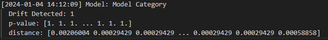

For both models, the detection of drift with that distance and p-value indicates a substantial difference between the features of the training dataset and those of the new data, suggesting that there might be a change in the underlying characteristics that could impact the model's performance.
