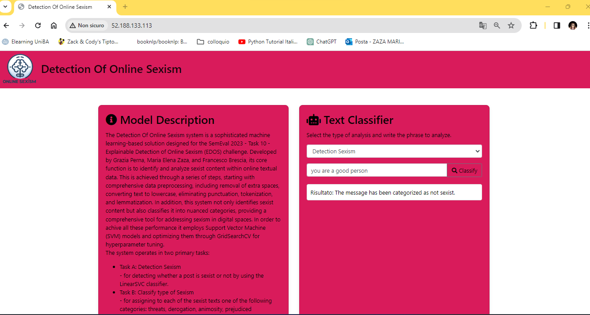
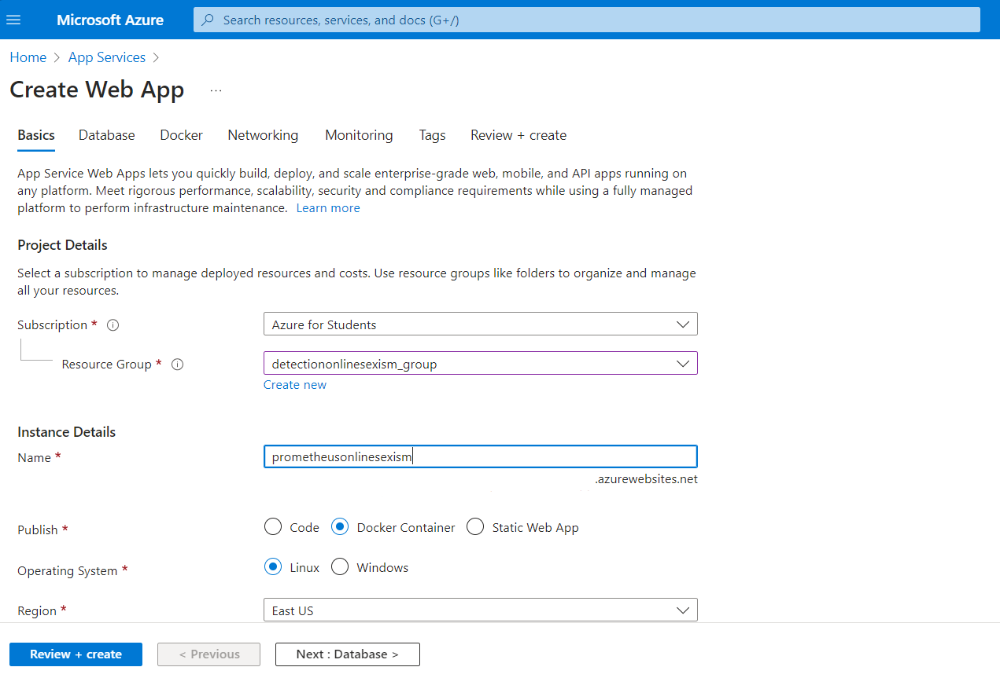
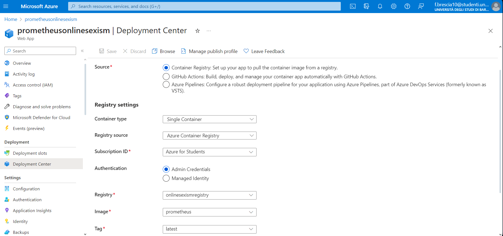

# System Deploy documentation

## Introduction

This guide is tailored to provide you with a comprehensive understanding and step-by-step instructions for leveraging the powerful capabilities of Azure to host and manage your machine learning solutions. You will be equipped with the knowledge to effectively deploy and manage your machine learning system on Azure, ensuring a scalable, secure, and high-performing application. Let's begin your journey to harnessing the full potential of Azure for your machine learning needs.

## Azure

[Azure](https://azure.microsoft.com)  is a cloud computing service created by Microsoft for building, testing, deploying, and managing applications and services through Microsoft-managed data centers. It provides a range of cloud services, including those for computing, analytics, storage, and networking. Azure offers solutions for all industries through a comprehensive set of tools and frameworks, supporting various programming languages, tools, and frameworks, including both Microsoft-specific and third-party software and systems.

## Deploy a multi-container group using Docker Compose
### Create and Log in to Azure container registry

Before you create your container registry, you need a resource group to deploy it to. A resource group is a logical collection into which all Azure resources are deployed and managed.

```bash
az group create --name detectiononlinesexism_group --location eastus
```

Now, we can create and log in to our Azure container registry 
```bash
az acr create --resource-group detectiononlinesexism_group --name onlinesexismregistry --sku Basic

az acr login --name onlinesexismregistry
```

### Docker compose file
Open [docker-compose.yml](../../docker-compose.yml) in a text editor and we write the following configuration:

```bash
version: '3.4'

services:
  frontend:
    build: 
      context: ./frontend
    image: onlinesexismregistry.azurecr.io/frontend
    ports:
      - "80:80"

  backend:
    build: .
    image: onlinesexismregistry.azurecr.io/backend
    ports:
      - "8000:8000"
```
### Run multi-container application locally
Ater that, we run the following instruction, which uses docker-compose.yaml file to build the container image, create the images, and start the application:

```bash
docker-compose up --build -d
```

After trying the local application, run docker-compose down to stop the application and remove the containers.
```bash
docker-compose down
```

### Push image to container registry
To deploy the application to Azure Container Instances, we need to push the local images to our container registry:
```bash
docker-compose push
```

### Create Azure context
To use Docker commands to run containers in Azure Container Instances, first we must log into Azure:
```bash
docker login azure
```

Then, we create an ACI context. This context associates Docker with an Azure subscription and resource group so that we can create and manage container instances.
```bash
docker context create aci myacicontext
```
### Deploy application to Azure Container Instances
Next, change to the ACI context. Subsequent Docker commands run in this context.

```bash
docker context use myacicontext
```

Finally, we can pull the images from our container registry and start the application in the Azure Container Instances, by using the following command:
```bash
docker compose up
```
Below we can see the result:

#### Frontend


#### Backend


When we finish trying the application, stop the application and containers with:
```bash
docker compose down
```

## Deploy the Prometheus dashboard creating a Web-App

In this section, we provide a step-by-step demonstration of how the Prometheus dashboard is deployed on Azure. 

### Push image to container registry
First of all, we create a new folder called `prometheus` where we go to insert our file [prometheus.yml](../../prometheus.yml) and define a new `Dockerfile`, as follows:

```bash
FROM prom/prometheus

WORKDIR /prometheus

COPY prometheus.yml /etc/prometheus/prometheus.yml

EXPOSE 9090
ENTRYPOINT [ "/bin/prometheus" ]
CMD [ "--config.file=/etc/prometheus/prometheus.yml", "--storage.tsdb.path=/prometheus" ]
```

Then, using the following instructions respectively let’s create the new Docker image, tag it with the name of our Container Registry and finally push the image on Azure.

```bash
docker build -t prometheus .

docker tag prometheus onlinesexismregistry.azurecr.io/prometheus   

docker push onlinesexismregistry.azurecr.io/prometheus  
```

### Create Azure Web-App
Using the Azure web interface, we create the `prometheusonlinesexism` Web-App filling the different required fields, taking care to select the option `Docker Container` as follows:



Once created the `prometheusonlinesexism` Web-App, we must select the field `Deployment Center` and chose from our Container Registry the Docker image that we want to upload on it. Below we can see the settings in the `Deployment Center`:

