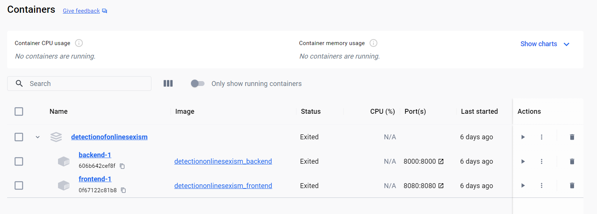

# Docker

Docker is a lightweight virtualization tool that allows us to isolate the development environment and ensure the reproducibility of our experiments.

## Components

- [Dockerfile](../../Dockerfile): The Dockerfile contains instructions for creating the Docker image. This file defines the environment and dependencies required to run backend of our machine learning project.

- [docker-compose.yml](../../docker-compose.yml): The docker-compose.yml file is used to configure the Docker service so that we can quickly start our development environment. It contains configurations for Docker services, volumes, and networks.

- [requirements.txt](../../requirements.txt): This file lists all the Python dependencies required for our machine learning project. These dependencies will be installed when the Docker image is created.

- [data/](../../data): This folder should contain all the training and test data required for the machine learning project. Make sure the data is accessible within the Docker container.

- [src/](../../src): In this folder, you may want to place our development scripts that we will use during the project. These can be mounted inside the Docker container for execution and editing.

- [prometheus.yml](../../prometheus.yml): The Prometheus configuration file. This file includes settings for monitoring the application, such as scrape configurations for gathering metrics from different sources, including the backend service.

## Docker File Configuration

The backend [Dockerfile](../../Dockerfile) performs the following tasks:

1. **Base Image**: Starts from the `python:3.10-slim` image, a lightweight Python image.
2. **Install Dependencies**: Copies the `requirements.txt` file and installs Python packages.
3. **Download NLTK Data**: Downloads WordNet and OMW-1.4 using NLTK.
4. **Working Directory**: Sets the root directory (`/`) as the working directory.
5. **Copy Source Code**: Copies the current directory contents into the Docker image.
6. **Expose Port 8000**: Makes the port 8000 available to the outside world.
7. **Command**: Sets the default command to run `uvicorn` for the web application on port 8000.

## Building and Running the Docker Container

To build and run this web application in a Docker container, follow these steps:

1. **Build the Docker Image**:
Navigate to the main directory containing the Dockerfile and run:
```bash
docker build -t detectionofonlinesexism_backend .
```

2. **Run the Docker Container**:
Start a container from the image:
```bash
docker run -d -p 8000:8000 detectionofonlinesexism_backend
```
This command runs the container in detached mode and maps port 8000 of the container to port 8000 on the host machine.

3. **Accessing the Backend**
Once the container is running, the backend of our web application should be accessible at http://localhost:8000


## Docker Compose Configuration

The `docker-compose.yml` file defines the following services:

-  **backend**: A service representing the backend of the application. It is built from the current context `.` and the resulting image is tagged as "detectiononlinesexism_backend." It exposes port 8000 for requests and also exposes it to be scraped by Prometheus.
-  **frontend**: A service representing the frontend of the application. It is built from the context of the `./frontend` folder, and the resulting image is tagged as "detectiononlinesexism_frontend." It exposes port 80 for requests. It depends on the "backend" service.
-  **prometheus**: Uses the `prom/prometheus` image. It mounts the `./prometheus.yml` file into the container at `/etc/prometheus/prometheus.yml.` It exposes port 9090 for accessing the Prometheus web UI. It depends on the "backend" service.
-  **grafana**: Uses the `grafana/grafana` image. It exposes port 3000 for accessing the Grafana web UI. It depends on the "prometheus" service.

## Usage

To use this Docker environment for our machine learning project, follow these steps:

1. Make sure you have Docker installed on your system.

2. Navigate to the directory containing these files.

3. Build the Docker images, which define the realtive images at the backend and the frontend with the dependencies specified in `requirements.txt`.

4. Start the Docker container based on the `docker-compose.yml` configuration:
```bash
docker-compose up
```

Alternatively, you can build and start the container in one step:
```bash
docker-compose up --build  
```
Once running, you can access the Docker development environment.

5. Access the Docker development environment and begin working on our machine learning projects. In our case, we can se the following dashboard:



6. When you're done, you can stop the Docker container with the following command:

```bash
docker-compose down
```

