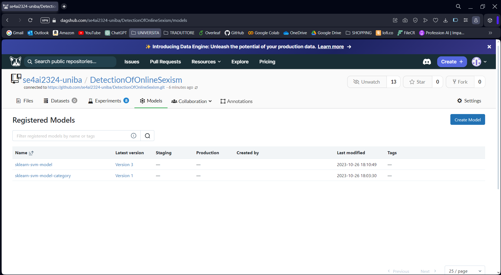
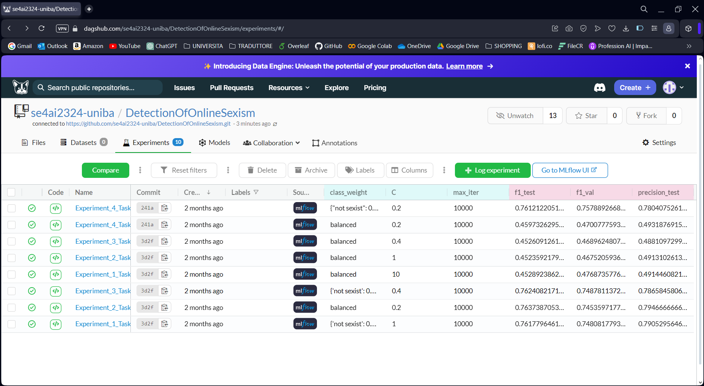

# DVC, MLflow, and DagsHub Integration for Machine Learning Projects

This project employs DVC (Data Version Control), MLflow, and DagsHub to manage and track the machine learning lifecycle. DVC is an open-source version control system tailored for data science and machine learning projects. MLflow is an open-source platform that handles the end-to-end machine learning lifecycle. DagsHub complements these tools by providing a platform for collaboration on data science projects.

## Overview

The integration of DVC, MLflow, and DagsHub provides a comprehensive solution for dataset management, versioning, experiment tracking, and model deployment. This synergy enhances the reproducibility, monitoring, and collaboration of machine learning projects.

## Features

- **Data Versioning with DVC**: Manages and version-controls large datasets and machine learning models, facilitating data sharing and collaboration.
- **Experiment Tracking with MLflow**: Records and compares experiments, parameters, and results, streamlining the model development process.
- **Model Deployment**: Leverages MLflow's model registry for consistent and organized deployment across various environments.
- **Collaboration with DagsHub**: Integrates with DVC and MLflow, offering a collaborative platform for team members to share, discuss, and track progress.
- **Reproducibility**: Ensure experiments are reproducible with version-controlled data and models.

## Installation

Before starting, ensure Python is installed. Then, install DVC, MLflow, and the necessary dependencies:

## Installation

Before you begin, ensure you have Python installed on your system. Then, install DVC and MLflow using pip:

```bash
pip install dvc mlflow
```

## Usage

### Setting Up DVC

1. **Initialize DVC in your Project**:
   ```bash
   dvc init
   git status
   git commit -m "Initialize DVC"
   ```

2. **Add Data to DVC**:
   Track large datasets or models with DVC:
   ```bash
   dvc add data/Raw/dataset.csv
   git add data/.gitignore data/Raw/dataset.csv.dvc
   git commit -m "Add dataset to DVC"
   ```

### Integrating MLflow

1. **Configure MLflow**:
   Set the tracking URI and specify the experiment name:
   ```bash
   mlflow set-tracking-uri ./mlruns
   mlflow create-experiment "my_experiment"
   ```

2. **Run an MLflow Experiment**:
   Utilize MLflow to log parameters, metrics, and models:
   ```python
   import mlflow

   with mlflow.start_run():
       mlflow.log_param("param_name", value)
       mlflow.log_metric("metric_name", value)
       mlflow.log_artifact("path/to/artifact")
   ```

## Integrating with DagsHub
DagsHub seamlessly integrates with DVC and MLflow, offering a platform for hosting and visualizing DVC-tracked datasets and MLflow experiments. Create a DagsHub repository to push and share your DVC and MLflow configurations and results. [DagsHub Repository](https://dagshub.com/se4ai2324-uniba/DetectionOfOnlineSexism)

1. **Set Up a DagsHub Repository**:
Create a repository on DagsHub and link it with your project.

2. **Push Changes to DagsHub**:
Commit and push your changes to the DagsHub repository to share your progress.

## Combining DVC, MLflow, and DagsHub

Use DVC for data and model management, MLflow for experiment tracking, and DagsHub for collaboration:

```bash
dvc pull data/Raw/dataset.csv.dvc
python mlflow_experiment.py
git add .
git commit -m "Update experiment"
git push origin main
```


## Versioning Data and Models

DVC tracks changes in your data and models. Use `dvc push` and `dvc pull` commands to synchronize your large files with remote storage, ensuring consistency across environments.



## Experiment Tracking

MLflow tracks each experiment's parameters, metrics, and output models, making it easy to compare different runs and select the best model for deployment.


## Model Deployment

Utilize MLflow's model registry for deploying models to various production environments, ensuring a smooth transition from experimentation to deployment.

## Collaboration and Sharing

DagsHub provides a platform for sharing experiments, data, and progress with team members, enhancing collaboration and transparency in the project.

## Best Practices

- Regularly commit changes in data and code to ensure reproducibility.
- Log all relevant experiment details in MLflow to facilitate analysis and comparison.
- Use DVC remotes for backing up and sharing large datasets and models.