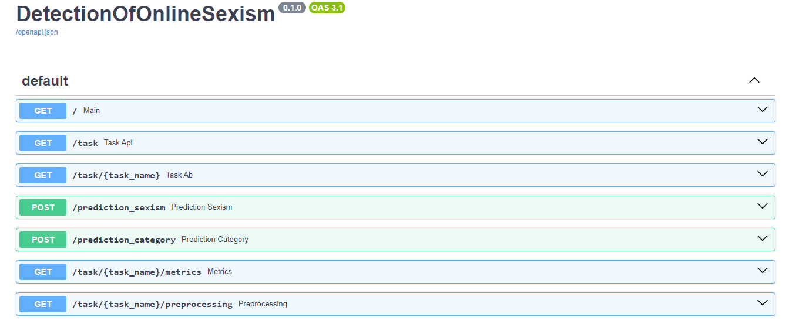
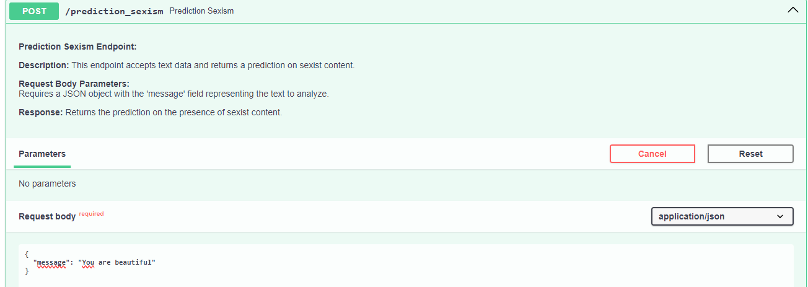
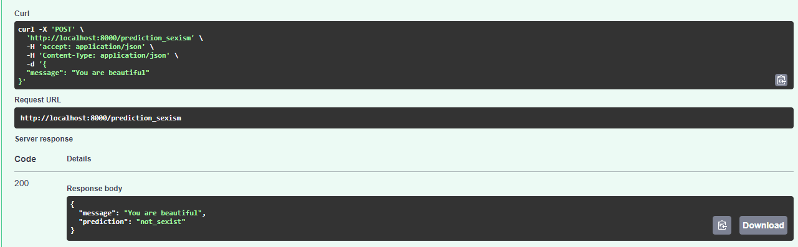
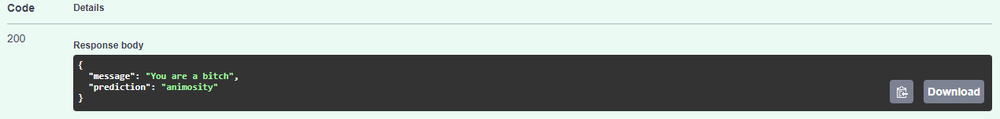
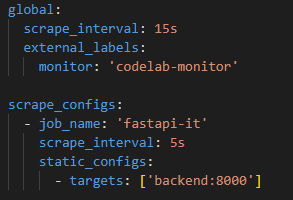
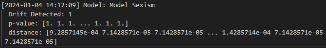
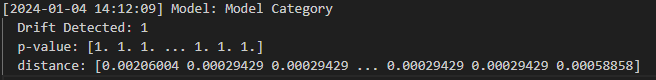

# Source Code Documentation

## Introduction

The `src` directory of our project includes two main components: the API and the feature-related code. The API is built using FastAPI, a high-performance web framework for building APIs with Python 3.7+. It's designed for automatic data validation and documentation generation, leveraging standard Python type hints. This section also covers the use of Docker Compose to launch a monitoring infrastructure with Prometheus and Grafana, along with a custom backend and frontend.

## API with FastAPI

The API is built using [FastAPI](https://fastapi.tiangolo.com/), a modern, high-performance web framework for building APIs with Python 3.7+. FastAPI leverages standard Python type hints for automatic data validation and documentation generation.

#### System Functionalities

Our API supports two main tasks:

1. **Sexism Detection Task**
   - Endpoint: `/prediction_sexism`

2. **Category Detection Task**
   - Endpoint: `/prediction_category`

#### Running the API

To start the FastAPI server:

```bash
uvicorn main:app --reload
```
#### Swagger UI
It is possible to test the API  using Swagger UI, a user-friendly interface that simplifies the understanding of API functionalities. To access to the Swagger UI, navigate too: http://127.0.0.1:8000/docs

Here is showed the main window of the UI.



As we can see in the picture there are two endpoint used to make the prediction of a given message. 

Here there is an example of the `/prediction_sexism` endpoint.



In the response body is showned the message that has been inserted from the user and the prediction.



Instead here we have an example  of the `/prediction_category` endpoint. The user has to insert the message and then it will be displayed the result.



## Monitoring with Prometheus and Grafana
### Prometheus

[Prometheus](https://prometheus.io/) is an open-source monitoring and alerting toolkit designed for reliability and scalability. It collects metrics from configured targets at specified intervals, evaluates rule expressions, and can trigger alerts if conditions are met. Prometheus scrapes metrics from the "backend" service, as specified in the configuration file. The collected metrics are stored locally in a time-series database. Prometheus provides a query language (PromQL) for querying and processing the collected metrics.

In order to acquire the metrics, fastAPI and Prometheus have been connected using the `docker-compose.yml` file.

#### Configuration
The Prometheus configuration file [prometheus.yml](../prometheus.yml) contains global settings and scrape configurations.



#### How to execute docker-compose.yml

1. Ensure Docker is installed.
2. Navigate to the directory containing the docker-compose.yml file.
3. Run `docker-compose up` to start the services in detached mode.
4. Now you can access the following services:

   -  **Prometheus UI**: http://localhost:9090
   -  **Grafana UI**: http://localhost:3000 (default credentials: admin/admin)

### Grafana
Grafana is an open-source analytics and observability platform that allows users to visualize and monitor data from various sources in real-time. In the context of this setup, Grafana is integrated with Prometheus to create interactive dashboards for monitoring a FastAPI application.

#### Configuration
The file [grafana.json](./api/dashboards/graphana.json) represents the configuration of a panel within Grafana. The main elements of this configuration are:

-  **Panel ID (id)**: A unique identifier for the panel.
-  **Panel Size (gridPos)**: Specifies the dimensions and position of the panel on the dashboard.
-  **Panel Options (options)**: Contains settings specific to the panel's behavior, such as tooltip management and legend display.
-  **Field Configuration (fieldConfig)**: Defines default settings and customizations for the panel's data field.
-  **Datasource (datasource)**: Specifies the datasource type (in this case, Prometheus) and a unique identifier (uid).
-  **Targets** represent different Prometheus metrics or expressions that the panel will display.

## Drift Detection with Alibi Detect

### Alibi Detect

Alibi Detect is an open-source Python library designed for outlier and adversarial instance detection, concept drift monitoring and machine learning model interpretability. It provides a collection of algorithms and tools to assess and enhance the trustworthiness of machine learning models in production.

Alibi Detect is often used to continuously monitor models in production, ensuring that they remain effective and reliable as the underlying data distribution evolves.

### Drift Detection

In [drift_detection.py](./features/drift_detection.py)`, we used Alibi Detect's KSDrift method for drift detection. Drift detection helps identifying if there is a significant shift in the statistical distribution of features between the training data and new generated fake data.

For tracking and recording drift detection results, we generated logs that contain valuable information about the drift detection process:

-   **Timestamp**: The current date and time when the log is created
-   **Model Name**: The name of the machine learning model being monitored (`Model Sexism` or `Model Category`)
-   **Drift Detected**: Indicates whether drift is detected
-   **p-value**: The p-value associated with the drift detection, providing a statistical measure of significance
-   **Distance**: The calculated distance representing the shift in the statistical distribution of features

### Results





For both models, the detection of drift with that distance and p-value indicates a substantial difference between the features of the training dataset and those of the new data, suggesting that there might be a change in the underlying characteristics that could impact the model's performance.
