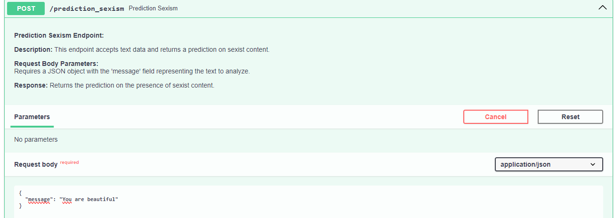
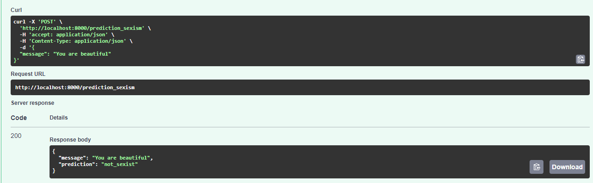
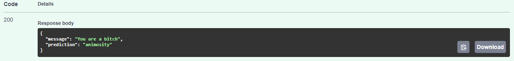

# API documentation

## Introduction

The API for our system is built using FastAPI, a modern, fast (high-performance) web framework for building APIs with Python 3.7+. FastAPI leverages standard Python type hints for automatic data validation and documentation generation.
In addition, it explains the usage of Docker Compose to launch a monitoring infrastructure that includes Prometheus and Grafana, a custom backend ("backend"), and a frontend.

## FastAPI

[FastAPI](https://fastapi.tiangolo.com/) is employed as the primary framework for building our API. It provides a robust and efficient foundation for creating API endpoints with Python, ensuring high performance and ease of use.

### System Functionalities

The API supports the following system functionalities through two distinct tasks:

1. **Sexism Detection Task:**
   - **Endpoint:** `/prediction_sexism`

2. **Category Detection Task:**
   - **Endpoint:** `/prediction_category`

### Usage

To run the FastAPI server, execute the following command:

```bash
uvicorn main:app --reload
```
### Swagger UI
It is possible to test the API  using Swagger UI, a user-friendly interface that simplifies the understanding of API functionalities. To access to the Swagger UI, navigate to:

```bash
http://127.0.0.1:8000/docs
```
Here is showed the main window of the UI.


As we can see in the picture there are two endpoint used to make the prediction of a given message. 

Here there is an example of the `/prediction_sexism` endpoint.



In the response body is showned the message that has been inserted from the user and the prediction.



Instead here we have an example  of the `/prediction_category` endpoint. The user has to insert the message and then it will be displayed the result.




## Prometheus

[Prometheus](https://prometheus.io/) is an open-source monitoring and alerting toolkit designed for reliability and scalability. It collects metrics from configured targets at specified intervals, evaluates rule expressions, and can trigger alerts if conditions are met.

Prometheus scrapes metrics from the "backend" service, as specified in the configuration file. The collected metrics are stored locally in a time-series database.
Prometheus provides a query language (PromQL) for querying and processing the collected metrics.

In order to acquire the metrics, fastAPI and Prometheus have been connected using a docker compose file.
The provided docker-compose.yml file defines the following services:
-  **backend**: A service representing the backend of the application. It is built from the current context (".") and the resulting image is tagged as "detectiononlinesexism_backend." It exposes port 8000 for requests and also exposes it to be scraped by Prometheus.
-  **frontend**: A service representing the frontend of the application. It is built from the context of the "./frontend" folder, and the resulting image is tagged as "detectiononlinesexism_frontend." It exposes port 8080 for requests. It depends on the "backend" service.
-  **prometheus**: Uses the "prom/prometheus" image. It mounts the "./prometheus.yml" file into the container at "/etc/prometheus/prometheus.yml." It exposes port 9090 for accessing the Prometheus web UI. It depends on the "backend" service.
-  **grafana**: Uses the "grafana/grafana" image. It exposes port 3000 for accessing the Grafana web UI. It depends on the "prometheus" service.

### Configuration
The Prometheus configuration file (prometheus.yml) contains global settings and scrape configurations.


### How to execute docker-compose.yml

1. Ensure Docker is installed.
2. Navigate to the directory containing the docker-compose.yml file.
3. Run `docker-compose up` to start the services in detached mode.
4. Now you can access the following services:

   -  **Prometheus UI**: http://localhost:9090
   -  **Grafana UI**: http://localhost:3000 (default credentials: admin/admin)

## Grafana
Grafana is an open-source analytics and observability platform that allows users to visualize and monitor data from various sources in real-time. In the context of this setup, Grafana is integrated with Prometheus to create interactive dashboards for monitoring a FastAPI application.

### Configuration
`grafana.json` represents the configuration of a panel within Grafana. The main elements of this configuration are:

-  **Panel ID (id)**: A unique identifier for the panel.
-  **Panel Size (gridPos)**: Specifies the dimensions and position of the panel on the dashboard.
-  **Panel Options (options)**: Contains settings specific to the panel's behavior, such as tooltip management and legend display.
-  **Field Configuration (fieldConfig)**: Defines default settings and customizations for the panel's data field.
-  **Datasource (datasource)**: Specifies the datasource type (in this case, Prometheus) and a unique identifier (uid).
-  **Targets** represent different Prometheus metrics or expressions that the panel will display.