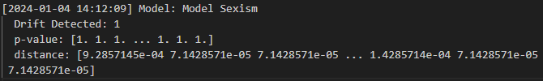

# Drift detection documentation

## Alibi Detect

Alibi Detect is an open-source Python library designed for outlier and adversarial instance detection, concept drift monitoring and machine learning model interpretability. It provides a collection of algorithms and tools to assess and enhance the trustworthiness of machine learning models in production.

Alibi Detect is often used to continuously monitor models in production, ensuring that they remain effective and reliable as the underlying data distribution evolves.

### Drift Detection

In `drift_detection.py`, we used Alibi Detect's KSDrift method for drift detection. Drift detection helps identifying if there is a significant shift in the statistical distribution of features between the training data and new generated fake data.

For tracking and recording drift detection results, we generated logs that contain valuable information about the drift detection process:

-   **Timestamp**: The current date and time when the log is created
-   **Model Name**: The name of the machine learning model being monitored (`Model Sexism` or `Model Category`)
-   **Drift Detected**: Indicates whether drift is detected
-   **p-value**: The p-value associated with the drift detection, providing a statistical measure of significance
-   **Distance**: The calculated distance representing the shift in the statistical distribution of features

### Results

For both models, the detection of drift with that distance and p-value indicates a substantial difference between the features of the training dataset and those of the new data, suggesting that there might be a change in the underlying characteristics that could impact the model's performance.
