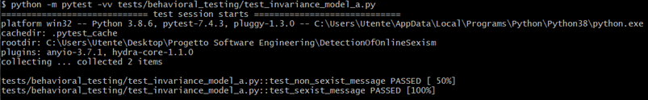
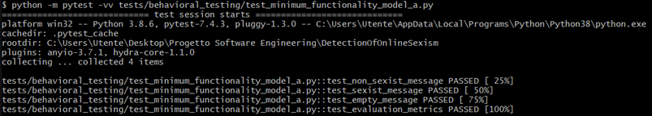
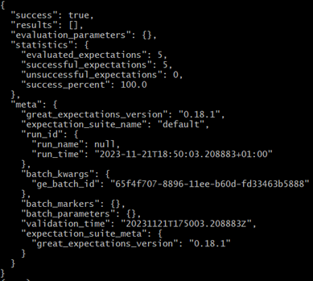
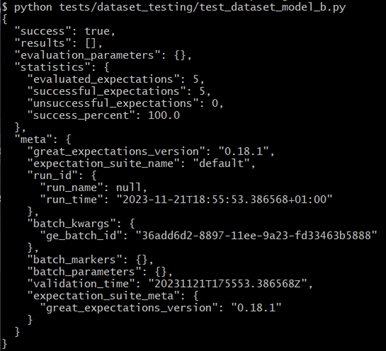

# Test documentation

In order to check the correctness of our project, we conducted several tests:
- Behavioral testing
- Dataset testing
- Model training testing
- Preprocessing testing

## Contributors

DetectionOfOnlineSexism team:
- Grazia Perna
- Maria Elena Zaza
- Francesco Brescia

For more information see [GitHubRepo](https://github.com/se4ai2324-uniba/DetectionOfOnlineSexism.git).

## Behavioral tests
### Directional Test

This type of test creates messages with distinct tokens and use the predictive models of task A and B to obtain the predicted labels for these messages. The primary objective is to assert that the predicted labels for messages featuring different tokens are not identical. So this test is designed to verify that the model can distinguish between specific tokens and generate varying predictions based on the token used in the input message.

The results obtained are shown below:
#### Model A

#### Model B

### Invariance Test

The objective of this test is to ensure that the model's classification of a message is not influenced by the choice of synonyms like "send" or "give." The test aims to confirm that the model maintains its ability to recognize and categorize messages consistently even when variations in language are introduced. This evaluation is essential for assessing the robustness of the model's discriminatory language detection across different expressions with similar meanings.

The results obtained are shown below:
#### Model A

#### Model B

### Minimum Functionality Test

This test serves as a comprehensive test suite for evaluating the performance of the two models of this project. The tests cover various scenarios, including different types of messages and the evaluation of model metrics.

The results obtained are shown below:
#### Model A

#### Model B

## Dataset tests

This script utilizes the Great Expectations library to perform data validation on three datasets: training, validation, and test sets. The primary goal is to ensure that the datasets meet certain expectations regarding structure and content.

The results obtained are shown below:
### Model A

### Model B

## Model training tests

It validates the training accuracy ensuring the model approximates a specified threshold. By confirming conformity to performance expectations, the test contributes to reliable machine learning model development and the assurance of accurate message classification.

The results obtained are shown below:

## Preprocessing tests

The tests cover scenarios such as punctuation removal, uppercase text transformation, empty input handling, and processing mixed text and numbers. Successful execution confirms the effective preprocessing capability of the `clean_text` function.

The results obtained are shown below:

## API tests
Tests concerning APIs implemented with FastAPI are crucial to ensure that the application is robust, reliable, and easy to maintain and develop over time to improve its efficiency. Tests ensure that all the application's functionalities work as expected, verifying that endpoints return the correct data and respond with the appropriate status codes. When changes are made to the code, tests help ensure that existing functionalities are not accidentally disrupted. Finally, by testing various scenarios, including behavior in abnormal conditions or the submission of invalid input, the application can be ensured to be secure and stable.

The results obtained are shown below:

