# Test documentation

## Introduction

In our commitment to ensuring the reliability and robustness of our project, we have implemented a comprehensive testing suite. This suite encompasses various forms of testing, each targeting specific components and functionalities of our system. Our aim is to maintain high standards of quality and correctness throughout the development lifecycle. 

The tests conducted are categorized as follows:

- **Behavioral Testing**: These tests are designed to validate the functionality of our application against the expected behavior. By simulating user interactions and system processes, we ensure that the application performs as intended in real-world scenarios.

- **Dataset Testing**: Given the critical role of data in our project, dataset tests focus on verifying the integrity, accuracy, and formatting of our datasets. These tests are crucial for ensuring that our data pipelines are reliable and our datasets are suitable for the tasks at hand.

- **Model Training Testing**: In this category, we test the training processes of our machine learning models. This includes validation of training algorithms, hyperparameter tuning, and the overall effectiveness of the training phase. The goal is to ascertain that our models learn correctly and efficiently from our datasets.

- **Preprocessing Testing**: These tests are aimed at the preprocessing steps of our data pipeline. We validate the methods used for cleaning, normalizing, and transforming data to ensure they are correctly implemented and contribute positively to the performance of our models.

## Tools

In our project, we place a strong emphasis on the reliability and quality of our software and data. To achieve this, we utilize two key tools: `Pytest` and `Great Expectations`. These tools form the backbone of our testing and validation framework, ensuring that our project meets high standards of functionality, dependability, and efficiency.

### Pytest

`Pytest` is a powerful and flexible testing framework for Python. It is used extensively for writing simple unit tests as well as complex functional tests. It offers features such as:

* A simple syntax for writing tests.
* The ability to run tests in parallel, significantly improving test execution time.
* Extensive support for fixtures, allowing for reusable test configurations.
* Easy integration with other tools and services for enhanced testing capabilities.

### Great Expectations

`Great Expectations` is an advanced tool that plays a crucial role in validating, documenting, and profiling our data quality. Great Expectations helps us by:

* Validating data against a predefined set of rules and criteria, ensuring that it meets the quality standards required for accurate analysis and modeling.
* Creating clear and understandable documentation of our data.
* Profiling data to provide insights into its characteristics, distribution, and structure of the data.

## Behavioral tests
### Directional Test

This type of test creates messages with distinct tokens and use the predictive models of task A and B to obtain the predicted labels for these messages. The primary objective is to assert that the predicted labels for messages featuring different tokens are not identical. So this test is designed to verify that the model can distinguish between specific tokens and generate varying predictions based on the token used in the input message. [Path: [Directory](./behavioral_testing)]

The results obtained are shown below:
#### Model A
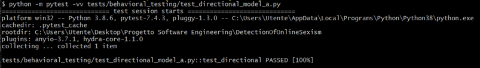

#### Model B
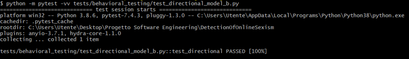

### Invariance Test

The objective of this test is to ensure that the model's classification of a message is not influenced by the choice of synonyms like "send" or "give." The test aims to confirm that the model maintains its ability to recognize and categorize messages consistently even when variations in language are introduced. This evaluation is essential for assessing the robustness of the model's discriminatory language detection across different expressions with similar meanings. [Path: [Directory](./behavioral_testing)]

The results obtained are shown below:
#### Model A
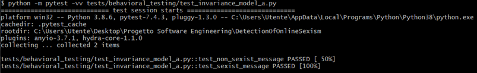

#### Model B

### Minimum Functionality Test

This test serves as a comprehensive test suite for evaluating the performance of the two models of this project. The tests cover various scenarios, including different types of messages and the evaluation of model metrics. [Path: [Directory](./behavioral_testing)]

The results obtained are shown below:
#### Model A
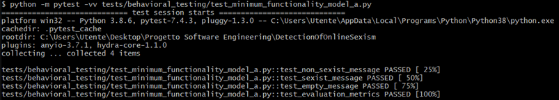

#### Model B
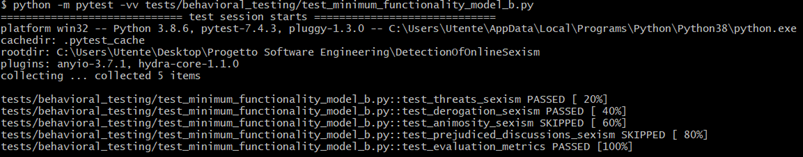

## Dataset tests

This script utilizes the Great Expectations library to perform data validation on three datasets: training, validation, and test sets. The primary goal is to ensure that the datasets meet certain expectations regarding structure and content. [Path: [Directory](./dataset_testing)]

The results obtained are shown below:
### Model A
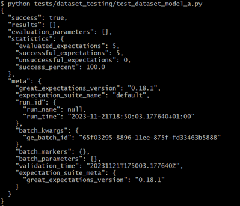
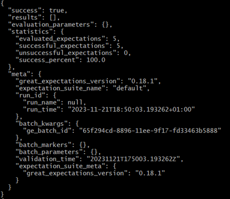
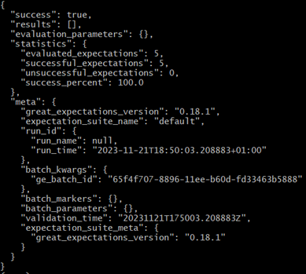

### Model B
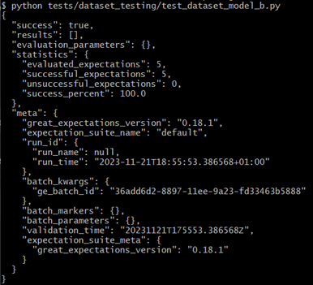
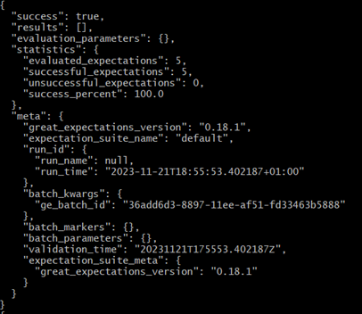
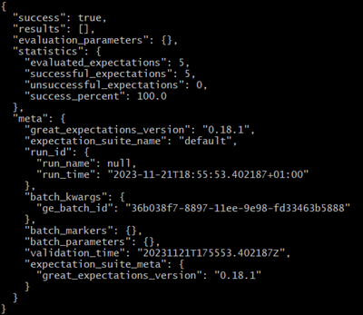

## Model training tests

It validates the training accuracy ensuring the model approximates a specified threshold. By confirming conformity to performance expectations, the test contributes to reliable machine learning model development and the assurance of accurate message classification. [Path: [Directory](./model_training_testing)]

The results obtained are shown below:
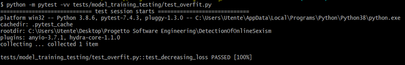

## Preprocessing tests

The tests cover scenarios such as punctuation removal, uppercase text transformation, empty input handling, and processing mixed text and numbers. Successful execution confirms the effective preprocessing capability of the `clean_text` function. [Path: [Directory](./preprocessing_testing)]

The results obtained are shown below:
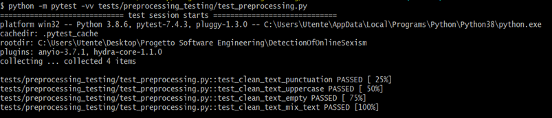

## API tests
Tests concerning APIs implemented with FastAPI are crucial to ensure that the application is robust, reliable, and easy to maintain and develop over time to improve its efficiency. Tests ensure that all the application's functionalities work as expected, verifying that endpoints return the correct data and respond with the appropriate status codes. When changes are made to the code, tests help ensure that existing functionalities are not accidentally disrupted. Finally, by testing various scenarios, including behavior in abnormal conditions or the submission of invalid input, the application can be ensured to be secure and stable. [Path: [Directory](./api_testing)]

The results obtained are shown below:
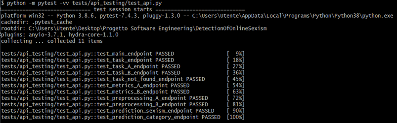
